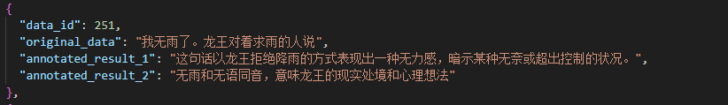
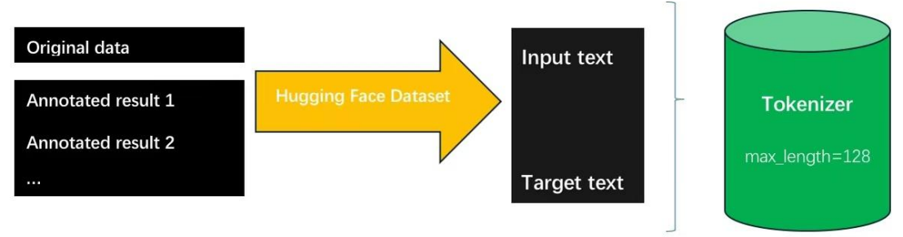
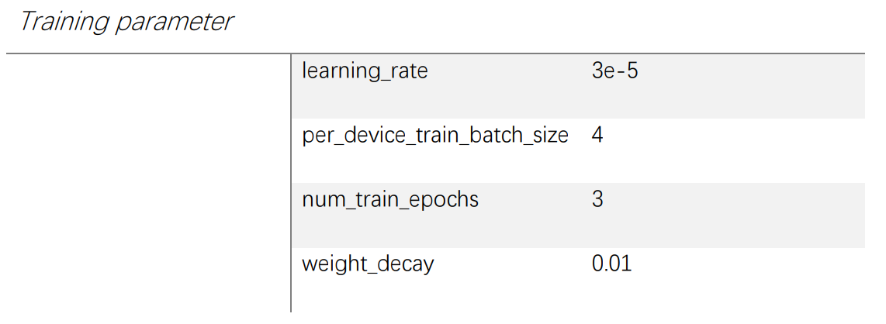
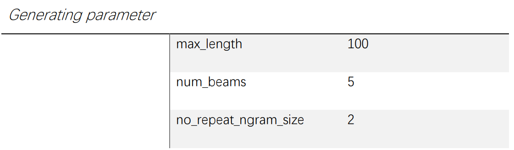
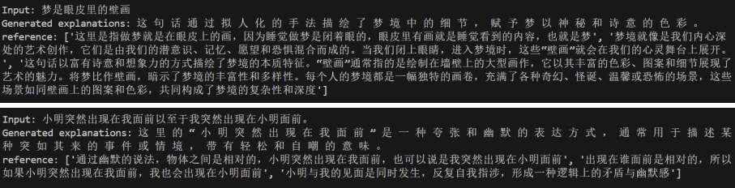

# Fine-tuning Chinese LLM for “RuoZhiBa” Text Explanation

- Fine-tuned BART-Large-Chinese model on the RuozhiBa dataset to interpret puns, metaphors, and sarcasm, improving semantic understanding of complex Chinese sentences. 

- Optimized generation via Beam Search and parameter tuning, achieving BLEU 0.3, BERTScore 0.6, and human evaluation scores of 1.0 fluency, 0.8 accuracy, 0.9 relevance. 

&nbsp;

## “RuoZhiBa” —— the last line of defense for humans against AI
### “弱智吧”，人类抵御AI的最后防线

“写遗嘱的时候错过了deadline怎么办？”
"What should I do if I miss the deadline when writing my testament?"

“英语听力考试总是听到两个人在广播里唠嗑，怎么把那两个干扰我做题的人赶走？”
"In the English listening exam, I always hear two people chatting on the broadcast. How can I get rid of these two people who are distracting me from answering the questions?"

The above philosophical but seemingly inexplicable questions come from Baidu Tieba's "RuoZhiBa" 2023 Annual Selection, which seems illogical, but if you think about it carefully, it does seem to make some sense.

Then, it becomes one of the best data to training AI's Chinese ability.

&nbsp;

## 🧩 Tech Stack
- Python

- PyTorch

- Hugging Face

&nbsp;

## Structure

```
├── LLM/               
│   ├── fine_tuned_bart_1/      // Trained models
│   ├── train_data/             // Training dataset (json)
│   ├── val_data/               // validation dataset (json)
│   │               
│   ├── bart.py                 // tunning LLM by training dataset                  
│   ├── test.py                 // runing testing 
│   ├── test.py                 // debugging or try
│   └── README.md               // Project documentation
```

&nbsp;

## Construction and Processing of Hugging Face Dataset
The given “RuozhiBa” dataset consists of original sentences and corresponding annotated 
explanations, and each original sentence has one or more explanations. 



In order to make full use of multiple explanations, in data preprocessing, we extract the original text of each sentence and all corresponding annotations, and convert them into the Hugging Face Dataset format to match the model input. Use tokenizer to tokenize the input text (original_data) and output text (annotated_result), and convert each sentence into a token sequence for easy model processing. 



In addition, in order to enable each sentence to be input into the model in batches, we use padding and truncation techniques to pad all sentences to the same length, while ensuring that longer sentences are truncated to the maximum length. 

&nbsp;

## Training parameter 



&nbsp;

## Generation Strategy
We switch to Beam Search as the algorithm for sequence generation. The key advantage of Beam Search is that it is more likely to generate high-quality sequences than greedy decoding because it retains a beam of candidate sequences when generating each word or symbol, rather than just one best candidate sequence. In addition, setting the no_repeat_ngram_size parameter can also prevent repeated outputs and increase the diversity of generation. A shorter max_length can effectively avoid lengthy generated explanations. 



&nbsp;

## Sample Output


&nbsp;

## Evaluation
The data was split using the 10-fold cross-validation method.

### Automatic
- As an evaluation standard based on n-gram exact matching, **BLEU** focuses on measuring the vocabulary overlap between the generated text and the reference text. 
- **BERTScore** can more accurately evaluate the performance of the model at the semantic level by calculating the deep semantic similarity between the generated text and the reference text.

### Human 
evaluated the generated results from three aspects: fluency (γ), accuracy (δ), and relevance (ε).

&nbsp;

## Author

#### Xin Jiang
- Bachelor degree @South China Normal University
- Bachelor degree @University of Aberdeen
- linkedin.con/in/xin-jiang12 (LinkedIn)


